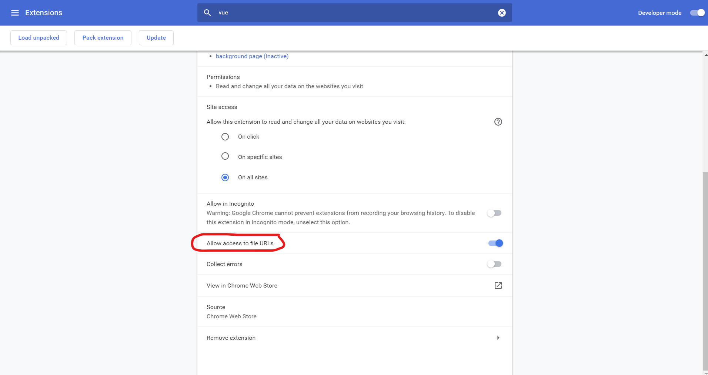

# 1. The Vue Instance
Install the **Vue.js devtools** chrome extension and `allow it to access to file URLs` by enable the **allow access to file URLs** option in the extension detail console.



The easiest way to start using `Vue` is to directly inject the `source code` of the library to our project. The link to the source code is provided in this page [this page](https://vuejs.org/v2/guide/).

```html
<!-- production version, optimized for size and speed -->
<script src="https://cdn.jsdelivr.net/npm/vue@2"></script>
```

## The Vue Instance
is the `root` of our application. It is created by using the `Vue` function.

```js
var app = new Vue({
  el: '#app', // form a relationship between Vue and a "portion" of the DOM, contained by the selected element (#app).
  data: { // add HTML element-bound data 
    product: 'Socks'
  }
});

setTimeout(function() {
  app.product = 'coat'; // update the Vue instance’s data
}, 2000);
```

**Data binding** `automatically` keeps your page up-to-date based on your `application's state`.

## Text interpolation
the `most basic` form of `data binding` is **text interpolation** using the `{{ }}` syntax:

here is how to bind the `rendered DOM` to an underlying Vue instance’s data.

```html
<h1>{{ product }}</h1>
```

## Using JavaScript Expressions
vue supports the full power of `JavaScript expressions` inside `all` data bindings (which we will learn in next lectures), not just the `text interpolation` data binding.

```html
{{ number + 1 }}

{{ ok ? 'YES' : 'NO' }}

{{ message.split('').reverse().join('') }}
```

**Notes:** `Template expressions` only have access to a `whitelist of globals` such as `Math` and `Date`. You should not attempt to access `user-defined globals` in template expressions.

# 2. Attribute Binding
to bind a Vue instance's data to an attribute of an HTMl element, we need to use the **v-bind** `directive`.

```js
var app = new Vue({
  // ...
  data: { 
    // ...
    image: './assets/vmSocks-green-onWhite.jpg'
  }
});
```

```html

```

## directives
are special `attributes` with the `v-` prefix. Directive attribute `values` are expected to be a single JavaScript expression (with the exception of `v-for`). A directive’s job is to `reactively` (via data binding) apply `side effects` to `its bound DOM` when the `value of its expression` changes.

```html
<p v-if="seen">Now you see me</p>
```

directives are made to replicate similar the behavior of HTML elements' attributes. That is, making changes to the DOM element to which an attribute is attached.

### Arguments
Some directives can take an `argument`, denoted by a `colon` after the directive name. For example, the v-bind directive is used to reactively update an HTML attribute:

```html

```

`src` is an argument, telling the `v-bind` directive to bind the element’s `src` attribute to the value of the `expression` url.

there are also **dynamic arguments** and **modifiers** which can be found [here](https://vuejs.org/v2/guide/syntax.html#Directives).

there’s a `shorthand` for `v-bind`, and it’s just a colon `:`.

```html

```

# 3. Conditional Rendering
how to use `v-if`, `v-else`, `v-else-if` to render/not render elements:

```html
<!-- ... -->
<p v-if="inventory > 10">In Stock</p>
<p v-else-if="inventory <= 10 && inventory > 0">Almost Sold Out</p>
<p v-else>Out of Stock</p>
<!-- ... -->
```

**notes:** the `previous sibling` element of the one having `v-else` `must have` `v-if` or `v-else-if`. Similarly, the `previous sibling` element of the one having `v-else-if` `must have` `v-if` or `v-else-if`. For example:

```html
<p v-if="inventory > 10">In Stock</p>
<p>nothing</p>
<p v-else-if="inventory <= 10 && inventory > 0">Almost Sold Out</p>
<p v-else>Out of Stock</p>
```

since there is a `p` HTML element sits in between the one having `v-if` and the one having `v-else-if` as well as the one having `v-else`, the `v-else-if` and the `v-else` will not work, they just simply not render their attached `p` elements.

## hide/show elements
use `v-show` to hide/show elements by conditionally add or remove the `CSS property` `display: none` to its attached element. This method is `more performant` than inserting and removing an element over and over with `v-if`/`v-else`/`v-else-if`.

```html
<p v-show="inStock">In Stock</p>
```

# 4. List Rendering
How to render DOM elements via a for loop in vue:

```html
<ul>
  <li v-for="detail in details">{{ detail }}</li>
</ul>
```

```js
var app = new Vue({
  el: '#app',
  data: {
    // ...
    details: ["80% cotton", "20% polyester", "Gender-neutral"]
  }
});
```

```html
<ul>
  <li v-for="detail of details">{{ detail }}</li>
</ul>
```

it is recommended to use a special **key** `attribute` aside with a **v-for** `directive` so that `Vue` can keep track of each DOM node’s identity. [Learn more](https://codelistic.com/how-and-why-to-use-the-key-attribute-in-vuejs-v-for-loops).

how to get the `index` of each iteration:

```html
<ul>
  <li v-for="(detail, index) in details">{{ detail }}</li>
</ul>
```

# 5. Event Handling
to trigger an event, use **v-on**, followed by a semicolon and the event's name.

```html
<div v-on:click="cart += 1">Add to cart</div>
```

```js
var app = new Vue({
  el: '#app',
  data: {
    // ...
    cart: 0
  }
});
```

how to create a method in a Vue instance and execute the method as an event is triggered:

```html
<div v-on:click="addToCart">Add to cart</div>
```

```js
var app = new Vue({
  el: '#app',
  data: {
    // ...
    cart: 0
  },
  methods: {
    addToCart: function() {
      this.cart += 1;
    }
  }
});
```

1. add a function to the **methods** property to define methods for a `Vue` instance.
2. make a reference to the newly created method.

**note:** the `this` expression inside the newly created `method` will refers to the `Vue instance` returned by the `Vue` function. In addition, we do not need to put a pair of `()` after the function expression, refering to the `method` if the method does not receive any argument.

there’s a `shorthand` for `v-on`, and it’s just a `@`.

```html
<p @mouseover="updateProduct(variant.variantImage)">{{ variant.variantColor }}</p>
```

we can also use the anonymous-function `ES6` shorthand for methods of a Vue instance. Just be aware of that not all browsers support this feature.

beside events used in the examples above (`click`, `mouseover`), we can also use the `submit` event on `form` elements as well as `keyup` on various ones.

```html
<form @submit="addToCart">...</form>
```

```html
<input @keyup.enter="send">
```

the `.enter` statement is a `modifier`, a `Key Modifier` to be more specific, in the combination with the `keyup` event, we are actually triggering the `send` event as the `enter` button is clicked. [Learn more](https://vuejs.org/v2/guide/events.html#Key-Modifiers)

# 6. Class & Style Binding
Just as when we use attribute directive, we can modify the styles of an element as below:

```html
<div
  v-for="variant in variants"
  :key="variant.variantId"
  class="color-box"
  :style="{ backgroundColor: variant.variantColor }"
  @mouseover="updateProduct(variant.variantImage)"
></div>
```

we are using a `camel-case name` of the `background-color` style property since we are using an object to modify the `backgound-color` style property of the `div` element. However, we can use the style property's original name as long as wrapping the name inside a pair of quotes.

```html
<div :style="{ 'background-color': variant.variantColor }"></div>
```

if we have multiple data containing styles of an element, we can add all of them to the `style` attribute using an array.

```html
<p :style="[styleObject, styleObject2]">...</p>
```

```js
var app = new Vue({
  el: '#app',
  data: {
    styleObject: {
      color: 'red',
      fontSize: '13px'
    },
    styleObject: {
      margin: '5px',
      padding: '20px'
    }
  }
});
```

## class binding
Similar to `style binding`:

```html
<div :class="{ active: activeClass, 'text-danger': errorClass }">Add to cart</div>
```

```js
// ...
  data: { // a Vue instance's data property
    activeClass: true,
    errorClass: false
  }
// ...
```

we can also passed in an array to the `attribute directive` to add static class name to an element.

```html
<div :class="[activeClass, errorClass]">Add to cart</div>
```

```js
// ...
  data: { // a Vue instance's data property
    activeClass: 'active',
    errorClass: 'text-danger'
  }
// ...
```

```html
<!-- the result: -->
<div class="active text-danger">Add to cart</div>
```

we can also do a conditional operation:

```html
<div :class="[isActive ? activeClass : '']">Add to cart</div>
```

```js
// ...
  data: { // a Vue instance's data property
    isActive: true,
    activeClass: 'active'
  }
// ...
```

# 7. Computed Properties
a `computed property` is a property of a Vue instance, holding the returned value of its `special method` counterpart as well as having the `identical name` to the method itself. Different a normal method, this `special method` cache `data properties` used inside it (`reactive dependencies`). Thus, as long as the `dependencies` have not changed, `multiple access` to the `computed property` will immediately return the `previously returned value` of its `special method` counterpart without having to run the method again.

`special methods` are defined inside the `computed` property of the argument object of the Vue function:

```js
var app = new Vue({
  el: '#app',
  data: {
    // ...
  },
  methods: {
    // ...
  },
  computed: {
    title() {
      return this.brand + ' ' + this.product;
    }
  }
});
```

we can then use the `special method`'s counterpart property (`computed property`) as shown in the example below:

```html
<h1>{{ title }}</h1>
```

# 8. Components
how to create a component named `product`:

```js
Vue.component('product', {
  template: `
    <div class="root-ele">
      // ...
    </div>
  `,
  data() {
    return {
      // data goes here
    }
  },
  methods: {
    // methods go here
  },
  computed: {
    // computed properties go here
  }
});
```

some notes:
1. `Component template` should contain exactly `one root element`, which is the `div.root-ele` in this case.
2. different from being a property, the `data` property in a component `MUST` be a function returning a `data` object since we often want to `reuse` components. And if we had multiple `product` components, each of them should have their own instance of `data`.

## components' props

we can have a component receiving data from its parent by using `props`.

```js
Vue.component('product', {
  props: [message],
  template: `
    <div class="root-ele">
      {{ message }}
    </div>
  `
});
```

```html
<!-- there 2 ways to pass a prop to a component -->

<!-- Static prop passing (everything, passed to the "message" prop are strings) -->
<product message="hello!"></product>
<!-- or -->
<!-- Dynamic prop passing (pass an expression to the "message" prop), similar to [input]="..." in Angular -->
<product :message="'hello!'"></product>
```

we are having the `product` component to receive a prop named `message`.

when defining a prop, it is recommended to specify requirements around the prop. To do that, we need to switch an array to an object and then define the prop as well as its requirements inside the object.

```html
Vue.component('product', {
  props: {
    message: {
      type: String,
      required: true,
      default: 'Hi'
    }
  },
  template: `
    <div class="root-ele">
      {{ message }}
    </div>
  `
});
```

## emitting events

```js
Vue.component('product', {
  // ...
  methods: {
    addToCart() {
      this.$emit('add-to-cart')
      
      // emit an event with an argument
      this.$emit('add-to-cart', this.variants[this.selectedVariant].variantId);
    }
  }
});
```

```html
<!--
  regardless of whether the "add-to-cart" event emits with an argument or not,
  we do not need to put a pair of "()" after the event handler expression
-->
<product @add-to-cart="updateCart"></product>
```

we are emitting the event `add-to-cart` which is handled by the `updateCart` event handler (just a `method`) using the `$emit` method.

# 10. Forms & v-model
## 2-way binding

we can perform a 2-way data binding using the `v-model` directive.

```js
Vue.component('product-view', {
  template: `
    <input v-model="name">
  `,
  data() {
    return {
      name: null
    }
  }
})
```

we can add a `modifier` behaving as a type-casting innotation to the `v-model` directive like this:

```html
<select id="rating" v-model.number="rating">
  <option>5</option>
  <option>4</option>
  <option>3</option>
  <option>2</option>
  <option>1</option>
</select>
```

we can also add an `event modifier` to an event when we trigger it using the **v-on** directive like this:

```html
<form class="review-form" @submit.prevent="onSubmit">
  // ...
</form>
```

## validations
Vue does not have default form-validation utilities. Thus, we have to do it on our own.

# 11. Tabs
## eventBus
A common solution for communicating from a grandchild up to a grandparent, or for communicating between components, is to use what’s called a `global event bus`.

This is essentially a channel through which you can send information amongst your components, and it’s just a Vue instance, `without any options` passed into it.

```js
// define the "eventBus" identifier at the top of the application
var eventBus = new Vue();
```

instead of emitting an event from a component, we will use the `eventBus` to emit the event:

```js
this.$emit('review-submitted', productReview)
```

use the `eventBus` itself to listen to the event, emitted by the `eventBus`.

```js
Vue.component('product', {
  // ...
  amounted() {
    eventBus.$on('review-submitted', productReview => {
      this.reviews.push(productReview)
    });
  }
});
```

here we are listening the `review-submitted` event as the `mounted` `lifecycle hook` (learn more later in the real-world course) is triggered.

**note:** notice that we are using an `arrow function` (es6) feature to handle the `review-submitted` event since we want to access to properties of the component instance of the `mounted` lifecycle hook.

## A Better Solution
a better solution would be `VueX`, Vue's own state-management library. Learn more in the `Mastering Vuex` course.
