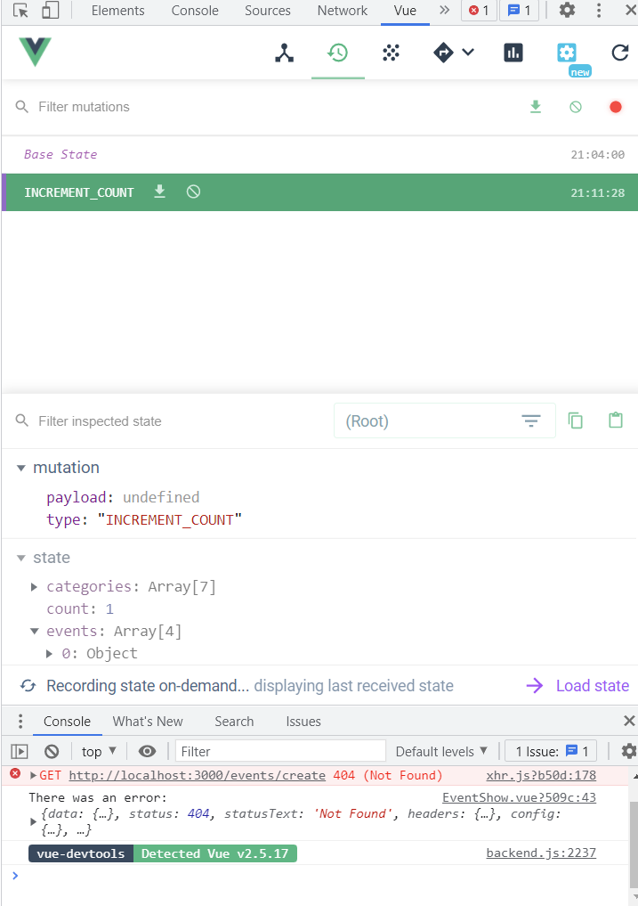
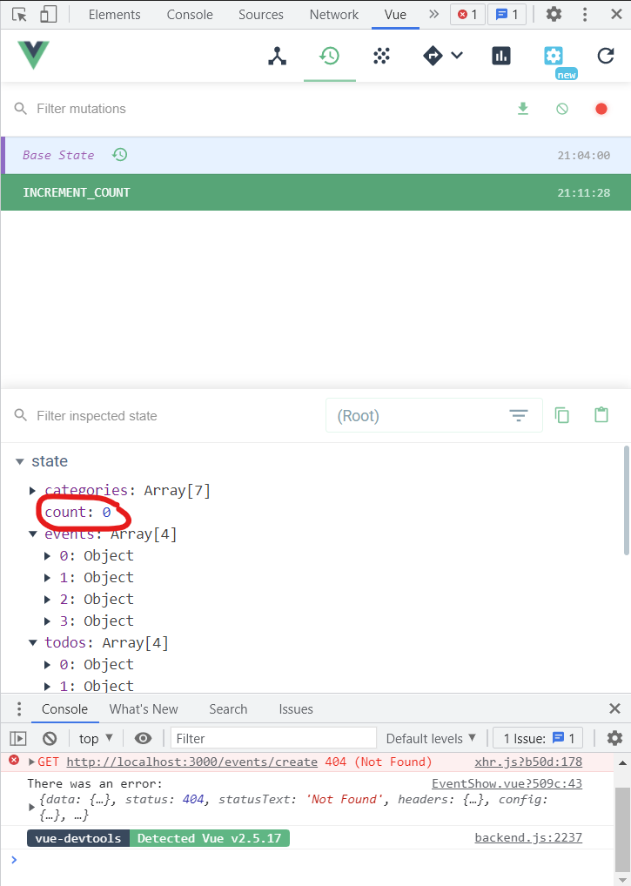
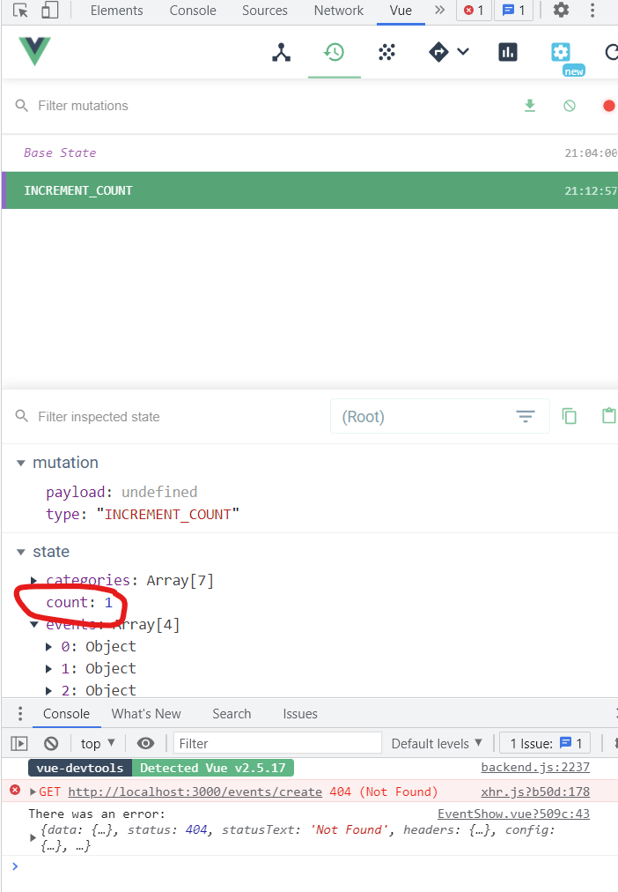

# Intro to Vuex
`Vuex 4` was recently released, the latest version of Vuex made to be compatible with `Vue 3`. Almost all `4 APIs` have remained the same from `Vuex 3`, which this course teaches. However, there are a few breaking changes that you can [learn about here](https://next.vuex.vuejs.org/guide/migrating-to-4-0-from-3-x.html#installation-process).

## The Case for State Management
`Vuex` based on `flux`, created by facebook.

`states` are the data that your components `depend on` and `render`. Without `Vuex`, as your app grows, each Vue component might have its own version of state.

But if one component changes its state, and a distant relative is `also using that same state`, we need to communicate that change by communicating events up and passing props down to share data, but that can become overly complicated. Instead, we can consolidate all of our state into one place that contains the current state of our entire application. One `single source of truth`. every component has direct access to this global State.

Just like the `Vue instance’s data`, this State is `reactive`. When one component updates the `State`, other components that are using that data get `notified`, `automatically receiving the new value`.

But just consolidating data into a single source of truth doesn’t fully solve the problems of managing state. What happens when `many components` alter the State `in different ways`, from `different locations`? We need some standardization. Otherwise, changes to our State could be unpredictable and untraceable.

A `State Management Pattern` This is why `Vuex` provides a `full state management pattern` for a simple and standardized way to `make state changes`. And if you’re familiar with `Vue`, `Vuex` should look quite similar.

```js
const store = new Vuex.Store({
  state: {
    isLoading: false,
    todos: []
  },
  mutations: {
    SET_LOADING_STATUS(state) {
      state.isLoading = !state.isLoading
    },
    SET_TODOS(state, todos) {
      state.todos = todos
    }
  },
  actions: {
    fetchTodos(context) {
      context.commit('SET_LOADING_STATUS')

      axios.get('/api/todos').then(response => {
        context.commit('SET_LOADING_STATUS')
        context.commit('SET_TODOS', response.data.todos)
      })
    }
  },
  getters: {
    doneTodos(state) {
      return state.todos.filter(todo => todo.done)
    }
  }
});
```

the above `vuex` instance's properties compared to a `vue` one:
* While the `Vue` instance has a `data` property, the `Vuex` store has `state`. Both are `reactive`.

* while the `instance` has `methods`, which among other things can update `data`, the `store` has `Actions`, which can update the `state` (via `mutations`).

* while the `instance` has `computed properties` to access `data`, the `store` has `getters` to access `state`.

* `Vuex` provides a way to `track state changes`, with `Mutations`. We can use `Actions` to `commit` `Mutations`, and from the `Vue DevTools`, we can even `trace back in time` through a record of each mutation to the state.

In our `State`, we have an `isLoading` property, along an array for `todos`.

Below that we have a `Mutation` to switch our `isLoading` state between `true` and `false`. And a `Mutation` to set our `state` with the `todos` that we’ll receive from an `API call` in our `action` below.

Our `Action` here has multiple steps. First, it’ll `commit` the `Mutation` to set the `isLoading` status to `true`. Then it’ll make an API call, and when the response returns, it will `commit` the `Mutation` to set the `isLoading` status to `false`. Finally it’ll commit the `Mutation` to set the state of our `todos` with the response from our API.

**note**:
* `mutations` can be directly commited inside components' methods `this.$store.commit('INCREMENT_COUNT')`, but with `actions`, we can share common logic which commit `mutations` for us to multiple components.

* **Mutations Must Be Synchronous**, any `state mutation` performed in the callback of an asynchronous `mutation` is essentially `un-trackable`!. `Mutations` are designed and created (by Vuex) to update `states` `whenever executed`, think of them like `setters`. Thus, there's `no need` to know when an asynchronous operation ends inside `mutations`.

* `actions` is similar to `mutations`, just functions. However, letting users to directly update `states` produces the problem that `Vuex` is trying to solve, that is no proper `state-change tracking`, it would be hard to track where states are changed. Thus, `mutations` have its own benefits here. Moreover, separating the `mutations` and `actions` would be easier to handle `asynchronous operations`, since tracking when asynchronous operations return is a no easy task. In this case, `mutations` role would be to track when asynchronous operations end. In addition, `actions` also play the role of making state changes easier to track in operations happening in the application layer (not the Vuex store layer).

# State & Getters
## Accessing State
If we take a look at our `main.js` file, we see we’re importing our `Vuex` `store` file, and providing it to our `root Vue instance`. This will be set up for us if we selected `Vuex` when creating our project with the `Vue CLI`.

```js
import store from './store' 

new Vue({
  router,
  store, // <-- injecting the store for global access
  render: h => h(App)
}).$mount('#app')
```

This makes the `store` globally accessible throughout our app by `injecting` it into every component. This way, `any component` can access the `store` and the properties on it (such as `State`, `Actions`, `Mutations` and `Getters`) by using `$store`.

**note**: `Vue` instances themselves do not have the `store` property, the property is added by the `Vuex` lib itself. FOr more information on how to add custom properties to the `option` argument object of `Vue` instances, [check this](https://vuejs.org/v2/api/#vm-options). We can see the lib is accessing the `store` property [here](https://github.com/vuejs/vuex/blob/dev/src/mixin.js):

```js
  function vuexInit () {
    const options = this.$options // <---
    // store injection
    if (options.store) {
      this.$store = typeof options.store === 'function'
        ? options.store()
        : options.store
    } else if (options.parent && options.parent.$store) {
      this.$store = options.parent.$store
    }
  }
```

Back to our section content, if our `store` looks like this:

```js
// src/store.js
import Vue from 'vue'
import Vuex from 'vuex'

Vue.use(Vuex)

export default new Vuex.Store({
  state: { // <---
    user: { id: 'abc123', name: 'Adam Jahr' }
  },
  mutations: {},
  actions: {}
})
```

Then we can access the `user` state like this:

```html
// EventCreate.vue
<template>
  <h1>Create Event, {{ $store.state.user.name }}</h1>
</template>
```

what if we needed to use the user’s name in multiple places within our `component`? Sure, we could write `this.$store.state.user.name` all over the place… Or we could write it once, in a `computed` property, called `userName`.

```html
<template>
  <div>
      <h1>Create an Event, {{ userName }}</h1>
      <p>This event is created by {{ userName }}</p>
  </div>
</template>

<script>
export default {
  computed: {
    userName() { // <---
      return this.$store.state.user.name
    }
  }
}
</script>
```

And if we needed to use it in a method of our component, we could simply say `this.userName`.

## The `mapState` Helper
If we need to access different parts of our `State` (in our `store`) from the `same component`, it can get repetitive to have `multiple computed properties` each returning `this.$store.state.something`. To simplify things, we can use the `mapState` helper provides us a quick way to access our `state` without having to directly make a reference to the `$store` property. In addition, it returns an object of functions, returning different parts of our `state` as how we tell them to return.

**note**: technically, the functions returned by the `mapState` helper simply return its associated part of our `state` as what we tell them to. Thus, we can pretty much use them anywhere we want (`methods`, `computed`,...). However, they are often used as `computed properties` to keep our app a highly performer.

```js
// store.js
// here is our store
import Vue from 'vue'
import Vuex from 'vuex'

Vue.use(Vuex)

export default new Vuex.Store({
  state: {
    user: { id: 'abc123', name: 'Adam Jahr' },
    categories: [
      'sustainability',
      'nature',
      'animal welfare',
      'housing',
      'education',
      'food',
      'community'
    ]
  },
  mutations: {},
  actions: {}
})
```

Now, in `EventCreate.vue`, we can import `mapState`. Then use it to `map` our `State` to a `computed property` that can retrieve our user’s name, and our categories.

```html
<template>
  <div>
      <h1>Create an Event, {{ userName }}</h1>
      <p>This event is created by {{ userName }}</p>
  </div>
</template>

<script>
import { mapState } from 'vuex'

export default {
  computed: mapState({
    userName: state => state.user.name,
    categories: state => state.categories
  })
}
</script>
```

Notice that we’re using a function, taking in `state` and returns the `property of the state` we want, `state.user.name` and `state.categories`. there’s an even `simpler way` to write this, like so:

```js
  computed: mapState({
    userName: state => state.user.name,
    categories: 'categories' // <-- simplified syntax for top-level State
  })
```

This is `equivalent` to `state => state.categories`.

We could simplify the `mapState` syntax `even more`, like so:

```js
  computed: mapState(['categories', 'user'])
```

now in our template we’d just need to use dot notation to access our user’s name.

```html
<h1>Create an Event, {{ user.name }}</h1>
```

**note**: to access `local state` with `this` inside the function, defined inside the `mapState` helper, a `normal function` **must** be used

```js
import { mapState } from 'vuex'

export default {
  computed: mapState({
    // to access local state with `this`, a normal function must be used
    countPlusLocalState (state) {
      return state.count + this.localCount
    }
  })
}
```

### Object Spread Operator
as `mapState` returns an `object of functions`, we can use `...` to merge the `object's functions` to other traditionally created ones.

```js
  computed: {
    traditionallyCreatedComputedProp() {
      return something
    },
    ...mapState(['categories', 'user']) // <-- using object spread operator
  }
```

## Getters
While we can access the Store’s `State` `directly`, sometimes we want to access `derived state`. 

```js
  computed: {
    catLength() {
      return this.$store.state.categories.length
    }
  }
```

But what if `multiple components` need to use this same value? By creating a `Vuex Getter`, we can avoid `unnecessary code duplication`. Also, since Getters are cached, this is a bit more performant of an option, too.

```js
// store.js
import Vue from 'vue'
import Vuex from 'vuex'

Vue.use(Vuex)

export default new Vuex.Store({
  state: {
    user: { id: 'abc123', name: 'Adam Jahr' },
    categories: [
      'sustainability',
      'nature',
      'animal welfare',
      'housing',
      'education',
      'food',
      'community'
    ]
  },
  mutations: {},
  actions: {},
  getters: {}
})

```

As you can see, `Getters` `are` a function that takes in the `state` as an argument, and allows us to return `processed or filtered state`.

let’s use our `catLength` Getter. Just like accessing State, we’ll put it in a `computed property`.

### Passing getters to Getters 
we can pass in `getters` as the `second argument` to a `Getter`. This allows us to access another `Getter` from within the `Getter` we’re creating.

```js
// store.js
...
export default new Vuex.Store({
  state: {
    ...
    todos: [
      { id: 1, text: '...', done: true },
      { id: 2, text: '...', done: false },
      { id: 3, text: '...', done: true },
      { id: 4, text: '...', done: false }
    ]
  },
  getters: {
    doneTodos: state => {
      return state.todos.filter(todo => todo.done)
    },
    activeTodosCount: (state, getters) => { // <--- getters returns all the getters of this store
      return state.todos.length - getters.doneTodos.length
    }
  }
})
```

This example was just to demonstrate the power of passing in getters to a Getter, there are better way to write the `activeTodosCount` getter.

## Dynamic Getters
we can creat `dynamic getters` by returning a function and pass arguments to the function. For example, if we had an array of events, we could retrieve an event by `id` like so:

```js
import Vue from 'vue'
import Vuex from 'vuex'

Vue.use(Vuex)

export default new Vuex.Store({
  state: {
    events: [
      { id: 1, title: '...', organizer: '...' },
      { id: 2, title: '...', organizer: '...' },
      { id: 3, title: '...', organizer: '...' },
      { id: 4, title: '...', organizer: '...' }
    ]
  },
  getters: {
    getEventById: state => id => { // <---
      return state.events.find(event => event.id === id)
    }
  }
})
```

```html
<template>
  <div>
      <h1>Create an Event, {{ user.name }}</h1>
      <p>This event is created by {{ user.id }}</p>

      <!-- use the computed property here -->
      <p>{{ getEvent(1) }}</p>
  </div>
</template>

<script>
import { mapState } from 'vuex'

export default {
  computed: {
    getEvent() { // <--- a computed property returning the function "getEventById", returned by the "getEventById" getter
      return this.$store.getters.getEventById
    },
    ...mapState(['categories', 'user'])
  }
}
</script>
```

## The `mapGetters` Helper
Just like `accessing State` with `mapState`, we can map `Getters` to functions with the `mapgetters` helper, the types of arguments that the `mapGetter` helper receives are similar with the `mapState` one.

```html
<template>
  <div>
      <h1>Create an Event, {{ user.name }}</h1>
      <p>This event is created by {{ user.id }}</p>
      <p>{{ getEventById(1) }}</p>
  </div>
</template>

<script>
import { mapState, mapGetters } from 'vuex'

export default {
  computed: {
    ...mapGetters(['getEventById']),
    ...mapState(['categories', 'user'])
  }
}
</script>
```

# Mutations & Actions Pt. 1
we can use Mutations to `update`, or `mutate`, our `State`.

```js
// store.js

...
  state: {
    count: 0
  },
  mutations: {
    INCREMENT_COUNT(state) {
      state.count += 1
    }
  }
```

As you can see, our `INCREMENT_COUNT` mutation is taking in our Vuex `state` as an argument and using it to increment the `count`.

Now, Inside our `EventCreate` component, we’ll can commit the mutation:

```html
<template>
  <button @click="incrementCount">Increment</button>
</template>

<script>
  export default {
    methods: {
      incrementCount() {
        this.$store.commit('INCREMENT_COUNT');
      }
    }
  }
</script>
```

Checking the `Vue DevTools`, visit the `Vuex` tab, we can see our `count` is being updated. In addition, the `INCREMENT_COUNT` `mutation calls` are logged in the `DevTools` as well.



If we click on `Base State`, we’re able to `see` the `State` of our app `prior to` the `INCREMENT_COUNT Mutation` being committed. **Note** that the app's `states` will not be reverted in `real time` as we select `previously commited mutations`.




**note**:  If you’re wondering why our `Mutation` is in all `capital letters`, that’s because it’s common within `Flux-based` patterns to put them in all caps. This is optional.

## Dynamic Mutations
We can pass a payload to a `Mutation` to make it `dynamic`.

```js
// store.js

...
  state: {
    count: 0
  },
  mutations: {
    INCREMENT_COUNT(state, value) { // the "mutation" can now access a passed in argument, presented by the "value" argument
      state.count += value
    }
  }
```

```js
export default {
  data() {
    return {
      incrementBy: 1
    }
  },
  methods: {
    incrementCount() {
      this.$store.commit('INCREMENT_COUNT', this.incrementBy) // <--- pass the "incrementBy" data to the "INCREMENT_COUNT" mutation's handler 
    }
  }
}
```

## Actions
While Vuex `Mutations` are `synchronous`, meaning they will happen one after the other, `Actions` can be `asynchronous`. We can use `Actions` to wrap some `business logic` around a `Mutation`, or `Mutations`.

for example, if we only wanted to update the `count` if our app has a `user`, we could write:

```js
// store.js

  actions: {
    updateCount({ state, commit }, incrementBy) {
      if (state.user) {
        commit('INCREMENT_COUNT', incrementBy)
      } 
  }
```

note that It is using `object destructuring` to get `state` and `commit` from the `Vuex` `context object`: `{ state, commit }`.

The `context` object is the `first argument` of any `Action`, and it exposes the `same set of properties` that are on the `store instance` (`state`, `mutations`, `actions`, `getters`). So you can call `context.commit` to commit a `mutation`, for example. Or say `context.state.count` to get the value of the `count` State.

Additionally, `updateCount` is taking in the `payload` value. The payload is `the second argument` of all `Actions`.

Now, within our `component`, we’d `dispatch` the `Action`.

```js
// component1.vue

...
  methods: {
    incrementCount() {
      this.$store.dispatch('updateCount', this.incrementBy)
    },
  }
```

**note**: the `this.$store.dispatch` method `always` returns a `Promise`, which always `resolve` the returned value of the `action`. Thus, if we return a `Promise`, we can call `.then` on the `.dispatch` method in our `component's method` so as to wait for the async operation inside the `Promise` resolves. For example:

```js
// store.js

import Vue from 'vue'
import Vuex from 'vuex'
import EventService from '@/services/EventService.js'

Vue.use(Vuex)

export default new Vuex.Store({
  actions: {
    createEvent({ commit }, event) {
      /**
       * the "EventService.postEvent" method will make an api request when the "createEvent" action is called.
      */
      return EventService.postEvent(event).then(() => {
        commit('ADD_EVENT', event.data)
      })
    }
  }
})
```

```js
// component.vue
...
methods: {
  createEvent() {
    this.$store
      .dispatch('createEvent', this.event)
      .then(() => { // <--- wait until the "postEvent" api responses
        this.event = this.createFreshEventObject()
      })
      .catch(() => {
        console.log('There was a problem creating your event.')
      })
  },
}
```

**note**: the `this.$store.commit` method always return `undefined`.

## routing inside components

we can use 

```js
// component.vue
...
methods: {
  createEvent() {
    this.$store
      .dispatch('createEvent', this.event)
      .then(() => {
        this.$router.push({ // <---
          name: 'event-show',
          params: { id: this.event.id }
        })
        this.event = this.createFreshEventObject()
      })
      .catch(() => {
        console.log('There was a problem creating your event.')
      })
  },
}
```

## Adding to Our Example App

```shell
npm install vuejs-datepicker --save
```

# Mutations & Actions Pt. 2
`json-server` actually has built-in [API pagination](https://github.com/typicode/json-server#paginate).  If we send it `_limit` as a parameter we can limit the number of items we show on a page, and `_page` will only give us the data on our `particular page`. So if we construct a URL like so: `/events?_limit=3&_page=2` our API will return 3 events per page, and will give us the events to list on page 2.

It would be greate if we knew how many events `we have total`. `json-server` is actually giving us this data on each event `request` listing as `a header`. We can see this by looking at the `Chrome DevTools → Network tab`, and inspecting one of our `API calls`. We’ll see:

```shell
X-Total-Count: 37
```

inside our Vuex `fetchEvents` action we could print this with:

```js
...
fetchEvents({ commit }, { perPage, page }) {
  EventService.getEvents(perPage, page)
    .then(response => {
      console.log('Total events are ' + response.headers['x-total-count'])
      commit('SET_EVENTS', response.data)
})
...
```

## Solution: Updating our router view
since doing `router navigation with query params` like below will not make `router-based rendered components`, ones rendered by the `router-view` component to be re-rendered

```html
<router-link :to="{ name: 'event-list', query: { page: page + 1 } }">Next Page</router-link>
```

we could use `:key` to push a `router-based rendered components` to be `re-rendered` as the `query params` change.

```html
<template>
  <div id="app">
    <router-view :key="$route.fullPath"/>
  </div>
</template>
```

# How does :key work
[full tutorial here](https://codelistic.com/how-and-why-to-use-the-key-attribute-in-vuejs-v-for-loops)

## How VueJS renders data in HTML templates:
`conceptually speaking`, VueJS renders `changes in data`.

```html
<h1>{{ blogPostTitle }}</h1>
```

Now imagine that the value of the variable `blogPostTitle` changes to another value. By default, VueJS is going to `optimize` this operation by `patching` the `<h1>` element, meaning that it’s going to `modify` the value (**content**) of the `element` that’s already there.

## ‘key’ special attribute in VueJS
In simple cases like this, `patching the element in-place` like described above is exactly what we want, but for certain other cases we want to give an extra `“hint”` to the VueJS virtual DOM algorithm to `avoid patching`, and instead `recreate the whole DOM element` (delete and create). For that purpose, we use the `:key` attribute.

```html
<h1 :key="blogPostTitle">{{ blogPostTitle }}</h1>
```

This tells the algorithm that whenever the `key` for the `<h1>` changes (which is set to `blogPostTitle`), it should `completely recreate the whole element`. In this example, it’s each time the value of the variable `blogPostTitle` itself changes.

## What can happen if we don’t use ‘:key’ in v-for ?

```html
<div id="app">
  <todo-item v-for="todo in todos" :item="todo"> 
  </todo-item>

  <button @click="addTodo">
    Add new item
  </button>
</div>
```

The Vue app is defined like this:

```js
new Vue({
  el: "#app",
  methods: {
      addTodo() {
        this.todos.unshift(
            { id: 2000, text: 'Write article' },
      );
    },
  },
  data() {
    return {
      todos: [
        { id: 1000, text: "Decide on article topic" },
        { id: 1001, text: "Prepare code example" },
        { id: 1002, text: "Prepare article outline" },
      ],
    };
  },
})
```

To render a list of `to-do` items themselves, we use a Vue component `todo-item` defined like this:

```js
Vue.component('todo-item', {
  props: {
      item: {
      type: Object,
      required: true,
    },
  },
  data() {
      return {
        isDone: false,
      };
  },
  template: `
      <div>
      <input type="checkbox" :id="item.id" v-model="isDone">
      <label :for="item.id">{{ item.text }}</label>
    </div>
  `
})
```

Notice we initialize the component’s local `isDone` variable to `false` since we want to make every `newly added to-do item` to be `“not done”`. Once we `first open` the app in the browser, we see the following:

[!](images/4.jfif)

let’s say we tick all of the items `“done”`:

[!](images/5.jfif)

This changes each of the component’s `isDone` variable to `true`. Now we click the `“Add new item”` button to add a new `“Write article”` to-do to the top, and we might be surprised to find this:

[!](images/6.jfif)

The issue lies in the fact that VueJS is `optimizing` `changes to the DOM` and `reusing the existing elements` (`patching them`) as much as possible. The `new item` was added to the top `in the same position` as the item `“Decide on article topic”` was placed before the new item was added. So `instead of` a new element being `created`, the `existing one` was `patched` with the `new “Write article” item`.

Because the `old DOM element` was `reused` and the `new one was not created`, the component was `not initialized` with `isDone: false` and the `existing value` of `isDone` which is set to `true` is used. If we had any logic in the Vue hooks like `created()` or `mounted()`, those would `not` run either.

On the other hand, the `“Prepare article outline”` item was `“pushed” off the bottom` and `ended up in a new position` that `didn’t exist before` in the DOM. So the `element` (`component`) was `re-created` and `isDone` was initialized to `false`. Again, this was not our intention.

## Solution: use the :key
```html
<div id="app">
  <todo-item v-for="todo in todos" :item="todo" :key="todo.id"> 
  </todo-item>

  <button @click="addTodo">
    Add new item
  </button>
</div>
```

As you can see, we used the `id` of each to-do item as the `key`. This way, since the `id` is `unique` for each to-do item, we are effectively “showing” the algorithm `which items were there before the change`, and `which one was added`.

Since the new to-do item has an `id=2000`, Vue knows that it’s a new item that `didn’t exist before` so it `creates a new component` to hold it and its `isDone` is initialized to `false`. For this simple example with `hard-coded` value { id: 2000, text: 'Write article' }, the button `should be clicked only once`, otherwise there would be `more items with the same id`, and that is `not allowed` either.

As for the rest of the existing to-do items, since they have the keys with the same id values `as before we clicked the button`, Vue knows it should `keep the existing components` and `place them in new positions`. That’s why their `isDone` values `remain unchanged`. Now we get the result we originally expected:

[!](images/7.jfif)

## Common misconception
uniqueness of items cannot be based on loop indices since those can be reused for new values (the ones, being `unshift`(ed) for example). That’s why it’s important to use a unique value like `id` for the `:key`.

# Modules

